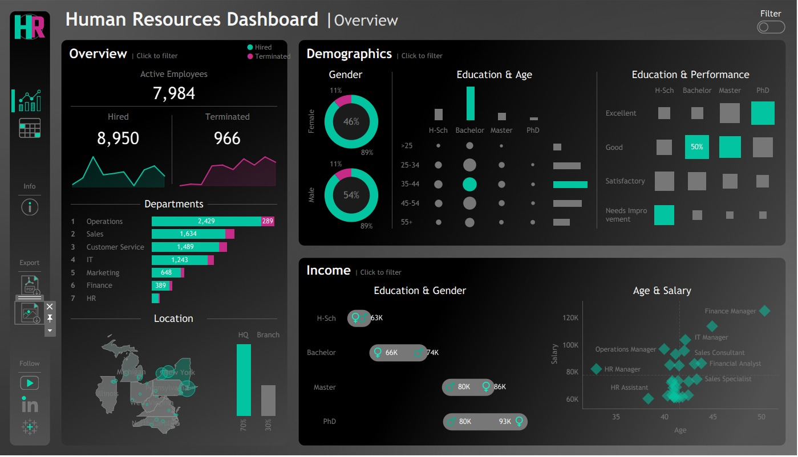

# HR Analytics Dashboard: Workforce Insights & Attrition Analysis

This project presents an interactive HR analytics dashboard built in Tableau, leveraging a synthetic dataset of 8,950 employees generated using Python (Pandas, NumPy, Faker). The dashboard provides data-driven insights into workforce distribution, attrition, demographics, education, salary trends, and performance metrics, enabling strategic decision-making for HR and leadership teams.

## 📊 Dashboard Preview

---

## 🔍 Key Insights

- **Workforce Overview**: Analyzed 7 departments, revealing an **11.2% attrition rate** (966 terminations) with the largest workforce share in **Operations (2,429)** and **Sales (1,634)**.
- **Location Trends**: Found **70%** of employees in headquarters vs **30%** in branches, guiding location-based expansion plans.
- **Diversity & Inclusion**: Gender split of **54% Male**, **46% Female**, with comparable attrition trends across groups.
- **Performance & Education**: Employees with **Masters/PhDs** consistently outperformed those with lower degrees, influencing hiring and L&D strategies.
- **Compensation Analysis**: Identified salary disparities by education and gender (e.g., Bachelor’s: **66K Female** vs **74K Male**), and mapped **age–salary progression**, showing senior roles like Finance/IT Managers earning **$100K+** in the 40–50 age range.

---

## 🛠 Tech Stack

- **Data Generation & Processing**: Python, Pandas, NumPy, Faker  
- **Data Visualization**: Tableau  
- **Dataset**: Synthetic HR dataset with attributes such as demographics, job role, salary, performance, and attrition data  

---

## 📈 Outcome

The dashboard transforms raw HR data into actionable business intelligence, helping organizations optimize workforce planning, improve retention strategies, and address pay equity concerns.
